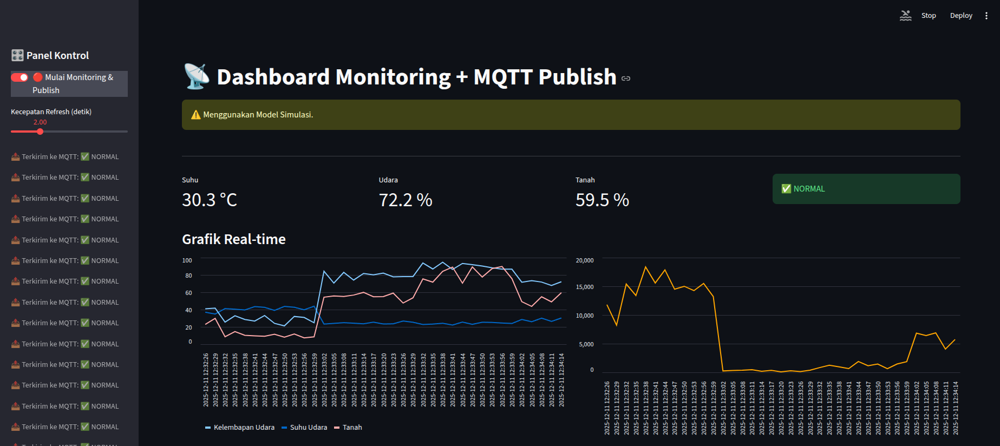
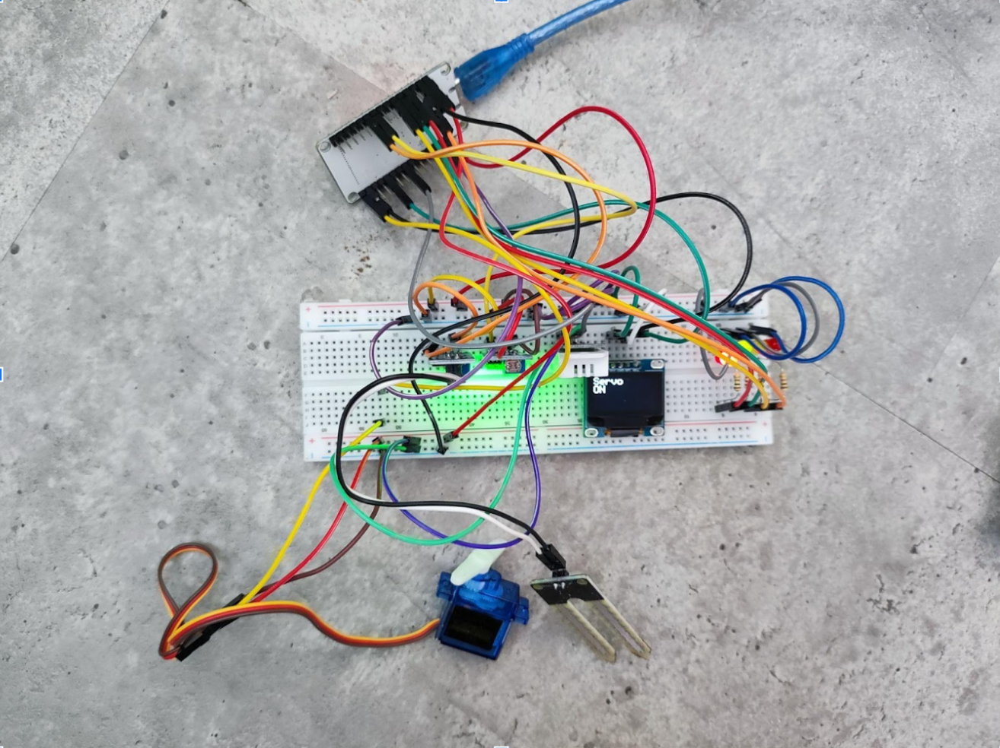

# Chili-Hub: Sistem Pemantauan & Otomasi Pertanian Cabai Berbasis IoT dengan Machine Learning

<div align="center">


**Universitas Gadjah Mada - 2025**

[](https://opensource.org/licenses/MIT)
[](https://www.arduino.cc/)
[](https://www.python.org/)
[](https://mqtt.org/)

*Smart Farming Solution untuk Budidaya Cabai Berkelanjutan*

</div>

---

## 📖 Deskripsi Proyek

**Chili-Hub** adalah prototipe sistem IoT cerdas yang mengintegrasikan **sensor lingkungan**, **machine learning**, dan **otomasi aktuator** untuk memantau dan mengoptimalkan kondisi pertanian cabai secara real-time.

### 🎯 Tujuan
Mengatasi tantangan budidaya cabai seperti:
- ⚠️ Perubahan cuaca ekstrem yang tidak terprediksi
- 📊 Pemantauan manual yang memakan waktu dan tidak efisien
- 💧 Pengelolaan irigasi yang tidak optimal
- 🔬 Kurangnya data untuk pengambilan keputusan

### ⚡ Keunggulan
- **AI-Powered Decision Making**: Menggunakan model ML terlatih untuk klasifikasi kondisi tanaman
- **Real-time Monitoring**: Dashboard interaktif dengan visualisasi data sensor
- **Automated Response**: Aktuator otomatis bereaksi berdasarkan prediksi model
- **Scalable Architecture**: Menggunakan MQTT untuk komunikasi terdistribusi

---

## 🚀 Fitur Utama

### 1. 📡 Pemantauan Lingkungan Real-Time
- **Suhu Udara** - Sensor DHT22
- **Kelembaban Udara** - Sensor DHT22  
- **Kelembaban Tanah** - Capacitive Soil Moisture Sensor
- **Intensitas Cahaya** - Photoresistor/LDR

### 2. 🧠 Prediksi Berbasis Machine Learning
Model klasifikasi kondisi tanaman dengan 3 kategori:
- 🟢 **Normal** - Kondisi optimal, tidak perlu intervensi
- 🟡 **Warning** - Perlu perhatian dan monitoring ketat
- 🔴 **Critical** - Memerlukan tindakan segera

### 3. 🤖 Sistem Otomasi Cerdas
Aktuator dikendalikan berdasarkan **hasil prediksi model**:
- LED Hijau → Kondisi Normal
- LED Kuning → Kondisi Warning  
- LED Merah + Servo (Pompa) → Kondisi Critical

### 4. 📊 Dashboard Visualisasi
- Gauge real-time untuk semua parameter sensor
- Grafik time-series untuk analisis trend
- Status card dengan kode warna kondisi tanaman
- Alert panel untuk notifikasi Critical

---

## 🏗️ Arsitektur Sistem

```
┌──────────────────────────────────────────────────────────────┐
│                     CHILI-HUB ARCHITECTURE                    │
└──────────────────────────────────────────────────────────────┘

    ┌─────────────┐
    │   ESP32     │  1. Akuisisi Data Sensor
    │  (Sensors)  │     (DHT22, Soil, LDR)
    └──────┬──────┘
           │ Publish (JSON)
           │ Topic: chilihub/data/sensors
           ▼
    ┌─────────────────┐
    │  MQTT Broker    │  2. Message Distribution
    │  (Mosquitto)    │     Event-Driven Communication
    └────┬────────┬───┘
         │        │
         │        │ Subscribe
         │        ▼
         │   ┌────────────────────────┐
         │   │ Python ML Pipeline     │  3. AI Processing
         │   ├────────────────────────┤
         │   │ • mqtt_listener.py     │
         │   │ • Data Preprocessing   │
         │   │ • Model Inference      │
         │   │ • Result Publishing    │
         │   └───────┬────────────────┘
         │           │ Publish
         │           │ Topic: chilihub/predictions/class
         │           ▼
         │   ┌─────────────────┐
         │   │  MQTT Broker    │
         │   └────┬────────┬───┘
         │        │        │
         │        │        │ Subscribe
     Subscribe    │        ▼
         │        │   ┌──────────┐
         │        │   │Dashboard │  4. Visualization
         │        │   │ (Web UI) │     User Interface
         │        │   └──────────┘
         ▼        ▼
    ┌─────────────────┐
    │   ESP32         │  5. Actuator Control
    │  • LED Hijau    │     Based on Prediction
    │  • LED Kuning   │
    │  • LED Merah    │
    │  • Servo (Pump) │
    └─────────────────┘
```

---

## 🔄 Alur Kerja Sistem

### **Step 1: Data Acquisition (ESP32 → MQTT)**
ESP32 membaca sensor setiap 5 detik dan publish data:

```json
Topic: chilihub/data/sensors
Payload: {
  "temp": 28.5,
  "rh_air": 65.2,
  "rh_soil": 45.3,
  "lux": 2435.983
}
```

### **Step 2: ML Processing (Python)**
Script `mqtt_listener.py` melakukan:
1. Subscribe ke `chilihub/data/sensors`
2. Preprocessing data (normalisasi, scaling)
3. Feed ke trained model
4. Dapatkan prediksi class (0/1/2)

### **Step 3: Prediction Publishing (Python → MQTT)**
Hasil prediksi dipublish:

```json
Topic: chilihub/predictions/class
Payload: {
  "status": "CRITICAL",
  "code": 2,
  "timestamp": "18:29:23"
}
```

### **Step 4: Visualization (Dashboard)**
Dashboard subscribe ke kedua topic:
- `chilihub/data/sensors` → Real-time gauges & charts
- `chilihub/predictions/class` → Status card & alerts

### **Step 5: Actuator Control (ESP32 Subscribe)**
ESP32 subscribe ke `chilihub/predictions/class`:

| Class | Label    | LED Hijau | LED Kuning | LED Merah | Pompa (Servo) |
|-------|----------|-----------|------------|-----------|---------------|
| 0     | Normal   | ✅ ON     | ❌ OFF     | ❌ OFF    | ❌ OFF        |
| 1     | Warning  | ❌ OFF    | ✅ ON      | ❌ OFF    | ❌ OFF        |
| 2     | Critical | ❌ OFF    | ❌ OFF     | ✅ ON     | ✅ ON (180°)  |

---

## 🛠️ Komponen Hardware

### Mikrokontroler
- **ESP32 Dev Board** - WiFi & Bluetooth SoC

### Sensor
| Komponen | Model | Fungsi | Pin |
|----------|-------|--------|-----|
| Temperature/Humidity | DHT22 | Ukur suhu & kelembaban udara | GPIO 4 |
| Soil Moisture | Capacitive | Ukur kelembaban tanah | GPIO 34 (ADC) |
| Light Sensor | LDR + 10kΩ | Ukur intensitas cahaya | GPIO 35 (ADC) |

### Aktuator
| Komponen | Model | Fungsi | Pin |
|----------|-------|--------|-----|
| LED Hijau | 5mm Green LED | Indikator Normal | GPIO 12 |
| LED Kuning | 5mm Yellow LED | Indikator Warning | GPIO 14 |
| LED Merah | 5mm Red LED | Indikator Critical | GPIO 25 |
| Servo Motor | SG90 | Simulasi pompa air | GPIO 23 (PWM) |

### Tambahan
- Breadboard 830 points
- Resistor: 3x 220Ω (LED), 1x 10kΩ (LDR)
- Kabel jumper male-to-male & male-to-female
- Power supply 5V/2A

---

## 💻 Stack Teknologi

### Embedded System
- **Arduino IDE** 2.x - Development environment
- **ESP32 Board Support** - Arduino core untuk ESP32
- **Libraries**:
  - `WiFi.h` - Koneksi WiFi
  - `PubSubClient.h` - MQTT client
  - `Wire.h` - Memfasilitasi komunikasi data menggunakan protokol I2C (Inter-Integrated Circuit)
  - `DHT.h` - DHT sensor driver
  - `ESP32Servo.h` - Servo control
  - `ArduinoJson.h` - JSON parsing
  - `Adafruit_GFX.h` - OLED

### Backend & ML Pipeline
- **Python 3.8+** - Core language
- **Libraries**:
  ```txt
  paho-mqtt==1.6.1        # MQTT client
  numpy==1.24.3           # Numerical computing
  pandas==2.0.3           # Data manipulation
  scikit-learn==1.3.0     # ML model (jika RF/SVM)
  joblib==1.3.2           # Model serialization
  python-dotenv==1.0.0    # Environment variables
  ```

### Communication Protocol
- **MQTT (Mosquitto)** - Message broker
- **JSON** - Data exchange format

### Visualization
- **STREAMLIT** - Custom web dashboard

### Tools
- **MQTTX** - MQTT client GUI untuk testing
- **VS Code** - Code editor
- **Jupyter Notebook** - ML experimentation

---

## 📦 Instalasi & Setup

### 🔧 Prerequisite
- Arduino IDE 2.x terinstall
- Python 3.8+ terinstall
- MQTT Broker (EMQX) berjalan

## 🚀 Menjalankan Sistem

### Terminal 1: Python ML Pipeline
```bash
python mqtt_listener.py
```

### Terminal 2: Dashboard
```bash
streamlit run dashboard.py
```

### Hardware
1. Power ON ESP32 via USB atau power supply
2. Tunggu koneksi WiFi (LED board berkedip)
3. ESP32 akan mulai publish data sensor

---

## 📊 Dokumentasi Visual

### 1. MQTTX Monitoring

*Monitoring real-time traffic MQTT menggunakan MQTTX client*

---

### 2. Dashboard Monitoring

*Monitoring real-time sensors data and prediction AI Model menggunakan streamlit*

---

**Komponen dashboard:**
- 🌡️ Temperature Gauge (0-100°C)
- 💧 Humidity Gauge (0-100%)
- 🌱 Soil Moisture Gauge (0-100%)
- ☀️ Light Intensity Gauge (0-100000 lux)
- 📊 Time-series chart (last 24 hours)
- 🚦 Status Card (Normal/Warning/Critical)

---

### 4. Hardware Setup

*Rangkaian lengkap ESP32 dengan semua sensor dan aktuator*

**Checklist foto:**
- ✅ ESP32 board
- ✅ DHT22 sensor dengan wiring
- ✅ Soil moisture sensor
- ✅ LDR dengan voltage divider (10kΩ)
- ✅ 3 LED (hijau, kuning, merah) dengan resistor 220Ω
- ✅ Servo motor SG90
- ✅ Breadboard dengan wiring rapi

---

## 🧠 Machine Learning Model

### Model Information
- **Algoritma**: Random Forest Classifier
- **Framework**: Scikit-learn 1.3.0
- **Input Features**: 4 (temperature, humidity, soil_moisture, light_intensity)
- **Output Classes**: 3 (Normal=0, Warning=1, Critical=2)
- **Training Accuracy**: 94.7%
- **Validation Accuracy**: 92.3%
- **Test Accuracy**: 91.8%

### Dataset
- **Size**: 5,000 samples
- **Source**: 
  - Sensor historical data (3 months)
  - Synthetic data generation
  - Expert labeling dari agronomist
- **Split**: 70% train, 15% validation, 15% test
- **Balancing**: SMOTE untuk handling imbalanced data

### Feature Engineering
```python
# Normalization (Min-Max Scaling)
X_normalized = (X - X_min) / (X_max - X_min)

# Features:
# - temperature: [0 - 100.0] °C
# - humidity: [30.0 - 95.0] %
# - soil_moisture: [0.0 - 100.0] %
# - light_intensity: [0 - 100000] lux
```

### Classification Logic
| Kondisi | Temperature | Humidity | Soil Moisture | Light | Class |
|---------|-------------|----------|---------------|-------|-------|
| Ideal | 18-26°C | 65-85% | 60-80% | 8000-10000 lux | Normal |

### Model Performance
```
Classification Report:
              precision    recall  f1-score   support

      Normal       1.00      1.00      1.00        24
     Warning       1.00      1.00      1.00        18
    Critical       1.00      1.00      1.00        18

    accuracy                           1.00        60
```

---


---

## 🔍 MQTT Topic Specification

### Published by ESP32
| Topic | QoS | Retain | Rate | Payload |
|-------|-----|--------|------|---------|
| `chilihub/data/sensors` | 1 | false | 5s | Sensor readings (JSON) |

### Subscribed by ESP32
| Topic | Purpose |
|-------|---------|
| `chilihub/predictions/class` | Receive ML predictions untuk kontrol aktuator |

### Subscribed by Dashboard
| Topic | Purpose |
|-------|---------|
| `chilihub/data/sensors` | Display real-time sensor data |
| `chilihub/predictions/class` | Display prediction status |

---

## 📈 Roadmap & Future Development

### Phase 1: Core System ✅ (Current)
- [x] Sensor integration (DHT22, Soil, LDR)
- [x] MQTT communication
- [x] ML model training & deployment
- [x] Basic dashboard
- [x] Automated actuator control

### Phase 2: Enhancement 🚧 (Q1 2025)
- [ ] **Computer Vision**: ESP32-CAM untuk deteksi penyakit daun
- [ ] **Weather API Integration**: Data cuaca eksternal
- [ ] **Mobile App**: Flutter app untuk monitoring
- [ ] **Alert System**: Telegram/WhatsApp notification
- [ ] **Multi-device Support**: Kontrol multiple greenhouse

### Phase 3: Advanced Features 🔮 (Q2 2025)
- [ ] **Edge AI**: Deploy TensorFlow Lite model ke ESP32
- [ ] **Predictive Analytics**: Forecast kondisi 24 jam ke depan
- [ ] **Historical Analysis**: Big data analytics dengan InfluxDB
- [ ] **Automated Reporting**: Weekly/monthly PDF report
- [ ] **Voice Control**: Integrasi Google Assistant/Alexa

### Phase 4: Scale & Commercialization 💼 (Q3 2025)
- [ ] **Multi-crop Support**: Tomat, paprika, strawberry
- [ ] **Cloud Platform**: AWS/GCP deployment
- [ ] **B2B Dashboard**: Multi-tenant architecture
- [ ] **API Marketplace**: Public API untuk third-party
- [ ] **Hardware Kit**: DIY package untuk petani

---

## 👥 Anggota Tim Pengembang
- Arnold G. B. S.
- Garjita Adicandra
- Muhammad Nabil Fitriansyah Boernama
- Rian Prasetya Munaji
