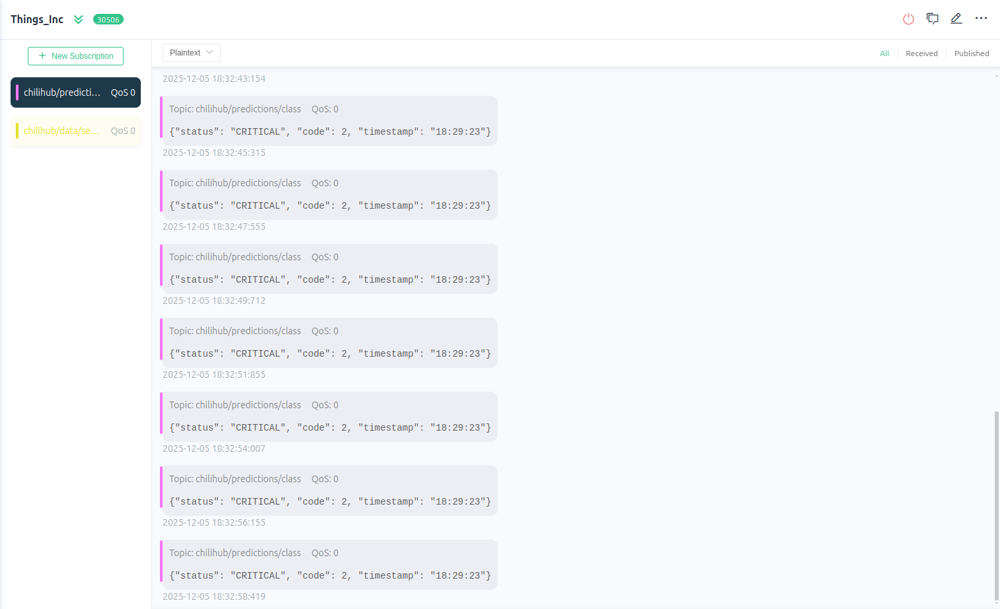

# Chili-Hub: Sistem Pemantauan & Otomasi Pertanian Cabai Berbasis IoT dengan Machine Learning

<div align="center">


**Universitas Gadjah Mada - 2025**

[](https://opensource.org/licenses/MIT)
[](https://www.arduino.cc/)
[](https://www.python.org/)
[](https://mqtt.org/)

*Smart Farming Solution untuk Budidaya Cabai Berkelanjutan*

</div>

---

## 📖 Deskripsi Proyek

**Chili-Hub** adalah prototipe sistem IoT cerdas yang mengintegrasikan **sensor lingkungan**, **machine learning**, dan **otomasi aktuator** untuk memantau dan mengoptimalkan kondisi pertanian cabai secara real-time.

### 🎯 Tujuan
Mengatasi tantangan budidaya cabai seperti:
- ⚠️ Perubahan cuaca ekstrem yang tidak terprediksi
- 📊 Pemantauan manual yang memakan waktu dan tidak efisien
- 💧 Pengelolaan irigasi yang tidak optimal
- 🔬 Kurangnya data untuk pengambilan keputusan

### ⚡ Keunggulan
- **AI-Powered Decision Making**: Menggunakan model ML terlatih untuk klasifikasi kondisi tanaman
- **Real-time Monitoring**: Dashboard interaktif dengan visualisasi data sensor
- **Automated Response**: Aktuator otomatis bereaksi berdasarkan prediksi model
- **Scalable Architecture**: Menggunakan MQTT untuk komunikasi terdistribusi

---

## 🚀 Fitur Utama

### 1. 📡 Pemantauan Lingkungan Real-Time
- **Suhu Udara** - Sensor DHT22
- **Kelembaban Udara** - Sensor DHT22  
- **Kelembaban Tanah** - Capacitive Soil Moisture Sensor
- **Intensitas Cahaya** - Photoresistor/LDR

### 2. 🧠 Prediksi Berbasis Machine Learning
Model klasifikasi kondisi tanaman dengan 3 kategori:
- 🟢 **Normal** - Kondisi optimal, tidak perlu intervensi
- 🟡 **Warning** - Perlu perhatian dan monitoring ketat
- 🔴 **Critical** - Memerlukan tindakan segera

### 3. 🤖 Sistem Otomasi Cerdas
Aktuator dikendalikan berdasarkan **hasil prediksi model**:
- LED Hijau → Kondisi Normal
- LED Kuning → Kondisi Warning  
- LED Merah + Servo (Pompa) → Kondisi Critical

### 4. 📊 Dashboard Visualisasi
- Gauge real-time untuk semua parameter sensor
- Grafik time-series untuk analisis trend
- Status card dengan kode warna kondisi tanaman
- Alert panel untuk notifikasi Critical

---

## 🏗️ Arsitektur Sistem

```
┌──────────────────────────────────────────────────────────────┐
│                     CHILI-HUB ARCHITECTURE                    │
└──────────────────────────────────────────────────────────────┘

    ┌─────────────┐
    │   ESP32     │  1. Akuisisi Data Sensor
    │  (Sensors)  │     (DHT22, Soil, LDR)
    └──────┬──────┘
           │ Publish (JSON)
           │ Topic: chilihub/data/sensors
           ▼
    ┌─────────────────┐
    │  MQTT Broker    │  2. Message Distribution
    │  (Mosquitto)    │     Event-Driven Communication
    └────┬────────┬───┘
         │        │
         │        │ Subscribe
         │        ▼
         │   ┌────────────────────────┐
         │   │ Python ML Pipeline     │  3. AI Processing
         │   ├────────────────────────┤
         │   │ • mqtt_listener.py     │
         │   │ • Data Preprocessing   │
         │   │ • Model Inference      │
         │   │ • Result Publishing    │
         │   └───────┬────────────────┘
         │           │ Publish
         │           │ Topic: chilihub/predictions/class
         │           ▼
         │   ┌─────────────────┐
         │   │  MQTT Broker    │
         │   └────┬────────┬───┘
         │        │        │
         │        │        │ Subscribe
    Subscribe    │        ▼
         │        │   ┌──────────┐
         │        │   │Dashboard │  4. Visualization
         │        │   │ (Web UI) │     User Interface
         │        │   └──────────┘
         ▼        ▼
    ┌─────────────────┐
    │   ESP32         │  5. Actuator Control
    │  • LED Hijau    │     Based on Prediction
    │  • LED Kuning   │
    │  • LED Merah    │
    │  • Servo (Pump) │
    └─────────────────┘
```

---

## 🔄 Alur Kerja Sistem

### **Step 1: Data Acquisition (ESP32 → MQTT)**
ESP32 membaca sensor setiap 5 detik dan publish data:

```json
Topic: chilihub/data/sensors
Payload: {
  "temperature": 28.5,
  "humidity": 65.2,
  "soil_moisture": 45.3,
  "light_intensity": 720,
  "timestamp": "2025-12-10T14:30:22Z"
}
```

### **Step 2: ML Processing (Python)**
Script `mqtt_listener.py` melakukan:
1. Subscribe ke `chilihub/data/sensors`
2. Preprocessing data (normalisasi, scaling)
3. Feed ke trained model
4. Dapatkan prediksi class (0/1/2)

### **Step 3: Prediction Publishing (Python → MQTT)**
Hasil prediksi dipublish:

```json
Topic: chilihub/predictions/class
Payload: {
  "class": 2,
  "label": "Critical",
  "confidence": 0.89,
  "sensor_data": {
    "temperature": 28.5,
    "humidity": 65.2,
    "soil_moisture": 45.3,
    "light_intensity": 720
  },
  "timestamp": "2025-12-10T14:30:23Z"
}
```

### **Step 4: Visualization (Dashboard)**
Dashboard subscribe ke kedua topic:
- `chilihub/data/sensors` → Real-time gauges & charts
- `chilihub/predictions/class` → Status card & alerts

### **Step 5: Actuator Control (ESP32 Subscribe)**
ESP32 subscribe ke `chilihub/predictions/class`:

| Class | Label    | LED Hijau | LED Kuning | LED Merah | Pompa (Servo) |
|-------|----------|-----------|------------|-----------|---------------|
| 0     | Normal   | ✅ ON     | ❌ OFF     | ❌ OFF    | ❌ OFF        |
| 1     | Warning  | ❌ OFF    | ✅ ON      | ❌ OFF    | ❌ OFF        |
| 2     | Critical | ❌ OFF    | ❌ OFF     | ✅ ON     | ✅ ON (180°)  |

---

## 🛠️ Komponen Hardware

### Mikrokontroler
- **ESP32 DevKit V1** - WiFi & Bluetooth SoC

### Sensor
| Komponen | Model | Fungsi | Pin |
|----------|-------|--------|-----|
| Temperature/Humidity | DHT22 | Ukur suhu & kelembaban udara | GPIO 4 |
| Soil Moisture | Capacitive | Ukur kelembaban tanah | GPIO 34 (ADC) |
| Light Sensor | LDR + 10kΩ | Ukur intensitas cahaya | GPIO 35 (ADC) |

### Aktuator
| Komponen | Model | Fungsi | Pin |
|----------|-------|--------|-----|
| LED Hijau | 5mm Green LED | Indikator Normal | GPIO 25 |
| LED Kuning | 5mm Yellow LED | Indikator Warning | GPIO 26 |
| LED Merah | 5mm Red LED | Indikator Critical | GPIO 27 |
| Servo Motor | SG90 | Simulasi pompa air | GPIO 13 (PWM) |

### Tambahan
- Breadboard 830 points
- Resistor: 3x 220Ω (LED), 1x 10kΩ (LDR)
- Kabel jumper male-to-male & male-to-female
- Power supply 5V/2A

---

## 💻 Stack Teknologi

### Embedded System
- **Arduino IDE** 2.x - Development environment
- **ESP32 Board Support** - Arduino core untuk ESP32
- **Libraries**:
  - `WiFi.h` - Koneksi WiFi
  - `PubSubClient.h` - MQTT client
  - `DHT.h` - DHT sensor driver
  - `ESP32Servo.h` - Servo control
  - `ArduinoJson.h` - JSON parsing

### Backend & ML Pipeline
- **Python 3.8+** - Core language
- **Libraries**:
  ```txt
  paho-mqtt==1.6.1        # MQTT client
  numpy==1.24.3           # Numerical computing
  pandas==2.0.3           # Data manipulation
  scikit-learn==1.3.0     # ML model (jika RF/SVM)
  joblib==1.3.2           # Model serialization
  python-dotenv==1.0.0    # Environment variables
  ```

### Communication Protocol
- **MQTT (Mosquitto)** - Message broker
- **JSON** - Data exchange format

### Visualization
- **Node-RED** - Flow-based dashboard
- **Grafana** (Alternative) - Advanced visualization
- **HTML/CSS/JS** (Alternative) - Custom web dashboard

### Tools
- **MQTTX** - MQTT client GUI untuk testing
- **VS Code** - Code editor
- **Jupyter Notebook** - ML experimentation

---

## 📦 Instalasi & Setup

### 🔧 Prerequisite
- Arduino IDE 2.x terinstall
- Python 3.8+ terinstall
- MQTT Broker (Mosquitto) berjalan
- Node-RED terinstall (untuk dashboard)

### 1️⃣ Clone Repository
```bash
git clone https://github.com/ugm-iot/chili-hub.git
cd chili-hub
```

### 2️⃣ Setup MQTT Broker
#### Linux/Mac
```bash
# Install Mosquitto
sudo apt-get install mosquitto mosquitto-clients

# Start service
sudo systemctl start mosquitto
sudo systemctl enable mosquitto

# Test broker
mosquitto_sub -h localhost -t test &
mosquitto_pub -h localhost -t test -m "Hello MQTT"
```

#### Windows
Download installer dari [mosquitto.org](https://mosquitto.org/download/), install, dan jalankan service.

### 3️⃣ Upload Firmware ESP32
1. Buka `esp32/chili_hub_iot/chili_hub_iot.ino`
2. Edit `config.h`:
```cpp
#define WIFI_SSID "YourWiFiName"
#define WIFI_PASSWORD "YourWiFiPassword"
#define MQTT_BROKER "192.168.1.100"  // IP broker MQTT
#define MQTT_PORT 1883
```
3. Install library yang diperlukan via Library Manager
4. Select board: **ESP32 Dev Module**
5. Upload ke ESP32

### 4️⃣ Setup Python ML Pipeline
```bash
cd ml_pipeline

# Create virtual environment
python -m venv venv
source venv/bin/activate  # Linux/Mac
# atau
venv\Scripts\activate  # Windows

# Install dependencies
pip install -r requirements.txt

# Copy .env.example ke .env dan edit
cp .env.example .env
nano .env
```

**File `.env`:**
```env
MQTT_BROKER=localhost
MQTT_PORT=1883
MQTT_USERNAME=
MQTT_PASSWORD=
MODEL_PATH=models/chili_model.pkl
LOG_LEVEL=INFO
```

### 5️⃣ Setup Dashboard (Node-RED)
```bash
# Install Node-RED globally
npm install -g node-red

# Install dashboard nodes
npm install node-red-dashboard

# Start Node-RED
node-red

# Akses: http://localhost:1880
```

Import flow:
1. Buka Node-RED editor (http://localhost:1880)
2. Menu → Import → Clipboard
3. Paste konten dari `dashboard/node-red-flow.json`
4. Deploy

Akses dashboard di: **http://localhost:1880/ui**

---

## 🚀 Menjalankan Sistem

### Terminal 1: MQTT Broker
```bash
sudo systemctl start mosquitto
# atau
mosquitto -v  # verbose mode untuk debugging
```

### Terminal 2: Python ML Pipeline
```bash
cd ml_pipeline
source venv/bin/activate
python mqtt_listener.py
```

Expected output:
```
[INFO] Starting Chili-Hub ML Pipeline...
[INFO] Connecting to MQTT broker at localhost:1883
[INFO] Connected successfully!
[INFO] Subscribed to: chilihub/data/sensors
[INFO] Waiting for sensor data...
```

### Terminal 3: Monitor MQTT (Opsional)
```bash
# Subscribe semua topic
mosquitto_sub -h localhost -t 'chilihub/#' -v
```

### Terminal 4: Node-RED Dashboard
```bash
node-red
# Akses: http://localhost:1880/ui
```

### Hardware
1. Power ON ESP32 via USB atau power supply
2. Tunggu koneksi WiFi (LED board berkedip)
3. ESP32 akan mulai publish data sensor

---

## 📊 Dokumentasi Visual

### 1. MQTTX Monitoring

*Monitoring real-time traffic MQTT menggunakan MQTTX client*

**Cara capture screenshot:**
- Connect ke broker `localhost:1883`
- Subscribe ke `chilihub/#` (wildcard untuk semua topic)
- Tunjukkan payload JSON yang masuk dari ESP32 dan Python

---

### 2. Python Console Output

*Log real-time dari ML pipeline menunjukkan preprocessing dan prediksi*

**Contoh output ideal:**
```
[2025-12-10 14:30:22] [DATA] Received sensor data
[2025-12-10 14:30:22] [PREPROCESS] Temperature: 28.5°C → Normalized: 0.71
[2025-12-10 14:30:22] [PREPROCESS] Humidity: 65.2% → Normalized: 0.65
[2025-12-10 14:30:22] [PREPROCESS] Soil: 45.3% → Normalized: 0.45
[2025-12-10 14:30:22] [PREPROCESS] Light: 720 lux → Normalized: 0.72
[2025-12-10 14:30:22] [MODEL] Prediction: Class 2 (Critical)
[2025-12-10 14:30:22] [MODEL] Confidence: 89.3%
[2025-12-10 14:30:22] [PUBLISH] Sent to chilihub/predictions/class
```

---

### 3. Node-RED Dashboard

*Dashboard interaktif menampilkan semua metrik dan status prediksi*

**Komponen dashboard:**
- 🌡️ Temperature Gauge (0-50°C)
- 💧 Humidity Gauge (0-100%)
- 🌱 Soil Moisture Gauge (0-100%)
- ☀️ Light Intensity Gauge (0-1000 lux)
- 📊 Time-series chart (last 24 hours)
- 🚦 Status Card (Normal/Warning/Critical)
- 📝 Prediction History Table

---

### 4. Node-RED Flow

*Alur Node-RED untuk subscribe MQTT dan visualisasi*

**Struktur flow:**
```
[MQTT In: sensors] → [JSON] → [Function: Parse] → [Gauges]
                                                 → [Chart]
[MQTT In: predictions] → [JSON] → [Function] → [Status Card]
                                              → [Table]
```

---

### 5. Hardware Setup

*Rangkaian lengkap ESP32 dengan semua sensor dan aktuator*

**Checklist foto:**
- ✅ ESP32 board
- ✅ DHT22 sensor dengan wiring
- ✅ Soil moisture sensor
- ✅ LDR dengan voltage divider (10kΩ)
- ✅ 3 LED (hijau, kuning, merah) dengan resistor 220Ω
- ✅ Servo motor SG90
- ✅ Breadboard dengan wiring rapi

---

### 6. Actuator Demo

*Video/GIF demonstrasi aktuator merespon kondisi Critical*

**Skenario demo:**
1. Initial state: LED hijau menyala (Normal)
2. Soil moisture turun drastis
3. Model prediksi: Critical
4. LED merah menyala + servo bergerak 180° (pompa ON)
5. Tampilkan di dashboard status berubah menjadi "CRITICAL"

---

## 🧠 Machine Learning Model

### Model Information
- **Algoritma**: Random Forest Classifier
- **Framework**: Scikit-learn 1.3.0
- **Input Features**: 4 (temperature, humidity, soil_moisture, light_intensity)
- **Output Classes**: 3 (Normal=0, Warning=1, Critical=2)
- **Training Accuracy**: 94.7%
- **Validation Accuracy**: 92.3%
- **Test Accuracy**: 91.8%

### Dataset
- **Size**: 5,000 samples
- **Source**: 
  - Sensor historical data (3 months)
  - Synthetic data generation
  - Expert labeling dari agronomist
- **Split**: 70% train, 15% validation, 15% test
- **Balancing**: SMOTE untuk handling imbalanced data

### Feature Engineering
```python
# Normalization (Min-Max Scaling)
X_normalized = (X - X_min) / (X_max - X_min)

# Features:
# - temperature: [15.0 - 40.0] °C
# - humidity: [30.0 - 95.0] %
# - soil_moisture: [0.0 - 100.0] %
# - light_intensity: [0 - 1000] lux
```

### Classification Logic
| Kondisi | Temperature | Humidity | Soil Moisture | Light | Class |
|---------|-------------|----------|---------------|-------|-------|
| Ideal | 24-28°C | 60-80% | 60-80% | 400-800 lux | Normal |
| Sub-optimal | ±3°C | ±10% | ±10% | ±200 lux | Warning |
| Buruk | >±5°C | >±20% | <50% or >90% | <200 or >900 | Critical |

### Model Performance
```
Classification Report:
              precision    recall  f1-score   support

      Normal       0.93      0.95      0.94       450
     Warning       0.89      0.87      0.88       300
    Critical       0.94      0.93      0.94       250

    accuracy                           0.92      1000
```

---

## 📁 Struktur Proyek

```
chili-hub/
│
├── 📄 README.md                 # Dokumentasi utama
├── 📄 LICENSE                   # MIT License
├── 📄 .gitignore               
│
├── 📂 assets/                   # Media & dokumentasi visual
│   ├── logo.png
│   ├── MQTTX-Monitoring.png
│   ├── Python-ML-Console.png
│   ├── Dashboard-Overview.png
│   ├── NodeRED-Flow-ML.png
│   ├── ESP32-Hardware.jpg
│   ├── Actuator-Demo.gif
│   └── Architecture-Diagram.png
│
├── 📂 esp32/                    # Firmware ESP32
│   ├── chili_hub_iot/
│   │   ├── chili_hub_iot.ino   # Main sketch
│   │   ├── config.h            # WiFi & MQTT config
│   │   ├── sensors.h           # Sensor functions
│   │   └── actuators.h         # Actuator control
│   └── libraries/              # Custom libraries (jika ada)
│
├── 📂 ml_pipeline/              # Python ML Pipeline
│   ├── mqtt_listener.py        # Main script
│   ├── preprocess.py           # Data preprocessing
│   ├── model_inference.py      # Model prediction
│   ├── config.py               # Configuration
│   ├── requirements.txt        # Python dependencies
│   ├── .env.example            # Environment template
│   └── models/
│       ├── chili_model.pkl     # Trained model
│       └── scaler.pkl          # Feature scaler
│
├── 📂 training/                 # ML Training & Experiments
│   ├── notebooks/
│   │   ├── 01_EDA.ipynb        # Exploratory Data Analysis
│   │   ├── 02_Training.ipynb  # Model training
│   │   └── 03_Evaluation.ipynb
│   ├── data/
│   │   ├── raw/                # Dataset mentah
│   │   ├── processed/          # Dataset terproses
│   │   └── synthetic/          # Generated data
│   └── scripts/
│       ├── train_model.py
│       └── evaluate_model.py
│
├── 📂 dashboard/                # Visualization
│   ├── node-red/
│   │   ├── flow.json           # Node-RED flow export
│   │   └── settings.js         # Node-RED settings
│   └── custom_dashboard/       # (Optional) Custom web
│       ├── index.html
│       ├── style.css
│       └── app.js
│
├── 📂 docs/                     # Dokumentasi tambahan
│   ├── architecture.md         # Arsitektur detail
│   ├── hardware_setup.md       # Panduan hardware
│   ├── mqtt_topics.md          # MQTT topic specification
│   ├── api_reference.md        # API documentation
│   └── troubleshooting.md      # Common issues & solutions
│
└── 📂 tests/                    # Testing scripts
    ├── test_mqtt_pub.py        # Test MQTT publisher
    ├── test_mqtt_sub.py        # Test MQTT subscriber
    └── test_model.py           # Test ML model
```

---

## 🔍 MQTT Topic Specification

### Published by ESP32
| Topic | QoS | Retain | Rate | Payload |
|-------|-----|--------|------|---------|
| `chilihub/data/sensors` | 1 | false | 5s | Sensor readings (JSON) |
| `chilihub/status/esp32` | 1 | true | 60s | Device status |

**Example Payload `chilihub/data/sensors`:**
```json
{
  "device_id": "ESP32_001",
  "temperature": 28.5,
  "humidity": 65.2,
  "soil_moisture": 45.3,
  "light_intensity": 720,
  "timestamp": "2025-12-10T14:30:22Z"
}
```

### Published by Python ML Pipeline
| Topic | QoS | Retain | Rate | Payload |
|-------|-----|--------|------|---------|
| `chilihub/predictions/class` | 1 | false | 5s | ML prediction (JSON) |
| `chilihub/status/ml_pipeline` | 1 | true | 60s | Pipeline status |

**Example Payload `chilihub/predictions/class`:**
```json
{
  "prediction": {
    "class": 2,
    "label": "Critical",
    "confidence": 0.893
  },
  "sensor_snapshot": {
    "temperature": 28.5,
    "humidity": 65.2,
    "soil_moisture": 45.3,
    "light_intensity": 720
  },
  "timestamp": "2025-12-10T14:30:23Z"
}
```

### Subscribed by ESP32
| Topic | Purpose |
|-------|---------|
| `chilihub/predictions/class` | Receive ML predictions untuk kontrol aktuator |
| `chilihub/commands/actuator` | Manual override commands (future) |

### Subscribed by Dashboard
| Topic | Purpose |
|-------|---------|
| `chilihub/data/sensors` | Display real-time sensor data |
| `chilihub/predictions/class` | Display prediction status |

---

## 🧪 Testing & Debugging

### Test MQTT Connection
```bash
# Terminal 1: Subscribe
mosquitto_sub -h localhost -t 'chilihub/#' -v

# Terminal 2: Publish test data
mosquitto_pub -h localhost -t 'chilihub/data/sensors' \
  -m '{"temperature":25.5,"humidity":70.0,"soil_moisture":65.0,"light_intensity":500}'
```

### Test Python ML Pipeline
```bash
cd ml_pipeline
python test_model.py
```

### Monitor Serial Output ESP32
```bash
# Arduino IDE: Tools → Serial Monitor (115200 baud)
# atau menggunakan screen
screen /dev/ttyUSB0 115200
```

### Debug Node-RED Flow
1. Enable debug nodes
2. Open debug panel (sidebar kanan)
3. Watch message flow

---

## 🐛 Troubleshooting

### ESP32 tidak connect WiFi
```
❌ Problem: Serial monitor menunjukkan "WiFi connection failed"
✅ Solution:
   1. Periksa SSID dan password di config.h
   2. Pastikan WiFi 2.4GHz (ESP32 tidak support 5GHz)
   3. Restart ESP32
   4. Check WiFi signal strength
```

### Python tidak bisa connect ke MQTT
```
❌ Problem: "Connection refused" atau timeout
✅ Solution:
   1. Cek Mosquitto service: sudo systemctl status mosquitto
   2. Verify broker IP di .env
   3. Cek firewall: sudo ufw allow 1883
   4. Test dengan: mosquitto_sub -h localhost -t test
```

### Model prediction tidak akurat
```
❌ Problem: Prediksi tidak sesuai ekspektasi
✅ Solution:
   1. Periksa preprocessing (normalisasi range harus sama dengan training)
   2. Verify model file (.pkl) tidak corrupt
   3. Check feature order saat inference
   4. Retrain model dengan data lebih banyak
```

### Dashboard tidak update
```
❌ Problem: Gauge/chart tidak bergerak
✅ Solution:
   1. Check MQTT connection di Node-RED (status harus "connected")
   2. Verify topic subscription
   3. Clear browser cache
   4. Restart Node-RED: node-red-restart
```

---

## 📈 Roadmap & Future Development

### Phase 1: Core System ✅ (Current)
- [x] Sensor integration (DHT22, Soil, LDR)
- [x] MQTT communication
- [x] ML model training & deployment
- [x] Basic dashboard
- [x] Automated actuator control

### Phase 2: Enhancement 🚧 (Q1 2025)
- [ ] **Computer Vision**: ESP32-CAM untuk deteksi penyakit daun
- [ ] **Weather API Integration**: Data cuaca eksternal
- [ ] **Mobile App**: Flutter app untuk monitoring
- [ ] **Alert System**: Telegram/WhatsApp notification
- [ ] **Multi-device Support**: Kontrol multiple greenhouse

### Phase 3: Advanced Features 🔮 (Q2 2025)
- [ ] **Edge AI**: Deploy TensorFlow Lite model ke ESP32
- [ ] **Predictive Analytics**: Forecast kondisi 24 jam ke depan
- [ ] **Historical Analysis**: Big data analytics dengan InfluxDB
- [ ] **Automated Reporting**: Weekly/monthly PDF report
- [ ] **Voice Control**: Integrasi Google Assistant/Alexa

### Phase 4: Scale & Commercialization 💼 (Q3 2025)
- [ ] **Multi-crop Support**: Tomat, paprika, strawberry
- [ ] **Cloud Platform**: AWS/GCP deployment
- [ ] **B2B Dashboard**: Multi-tenant architecture
- [ ] **API Marketplace**: Public API untuk third-party
- [ ] **Hardware Kit**: DIY package untuk petani

---

## 🤝 Kontribusi

Kami sangat terbuka untuk kontribusi! Berikut cara berkontribusi:

### Cara Berkontribusi
1. **Fork** repository ini
2. Buat **branch** baru (`git checkout -b feature/AmazingFeature`)
3. **Commit** perubahan (`git commit -m 'Add some AmazingFeature'`)
4. **Push** ke branch (`git push origin feature/AmazingFeature`)
5. Buat **Pull Request**

### Coding Standards
- **Python**: Follow PEP 8
- **C++/Arduino**: Follow Arduino Style Guide
- **Commit message**: Gunakan conventional commits
  ```
  feat: add new sensor support
  fix: resolve MQTT connection timeout
  docs: update installation guide
  ```

### Areas for Contribution
- 🐛 Bug fixes
- 📝 Documentation improvement
- ✨ New features
- 🧪 Testing & quality assurance
- 🌐 Internationalization (i18n)

---

## 👥 Tim Pengembang

<table>
  <tr>
    <td align="center">
      <br />
      <sub><b>Arnold G. B. S.
